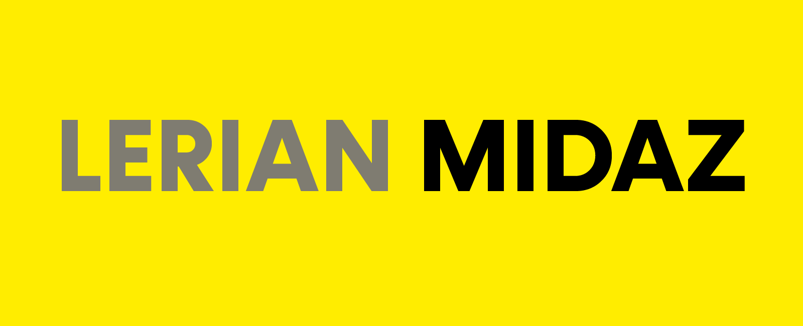

<div align="center">

[](https://github.com/LerianStudio/midaz/releases)

[](https://github.com/LerianStudio/midaz/releases)

[](https://discord.gg/DnhqKwkGv3)

</div>

## Midaz Console: Easy Management your Next-Gen Open-Source Ledger

Midaz console is a solution built to manage your midaz open-source ledger, with midaz console, you will be able to manage your entire operation related to Midaz in a simple and intuitive way.

Midaz Open-Source Ledger allows you to manage using API's, GRCP, CLI. The Midaz Console was designed for the operation of its users, facilitating all the work to be carried out on Midaz on a daily basis.

## Getting Start

To begin using Midaz console, you need to had a Midaz Open-Source Ledger running. Please follow our [Getting Started Guide](https://docs.midaz.io/getting-started) of [Midaz Open-Source Ledger](https://github.com/LerianStudio/midaz) . For comprehensive documentation on Midaz features, API references, and best practices, visit our [Official Documentation](https://docs.midaz.io).

### Prerequisites

- [Midaz Open-Source Ledger](https://github.com/LerianStudio/midaz) 
- Node.js (Version: >=18.x)
- NPM
- Docker: [Docker Installation](https://docs.docker.com/get-docker/)

- Docker Compose: [Docker Compose Installation](https://docs.docker.com/compose/install/)

## Steps to run the application locally

:warning: Before proceeding, please ensure that the [Midaz Open-Source Ledger](https://github.com/LerianStudio/midaz) environment is active and available.

Run the commands below to configure and start the local console stack.

```bash
npm run set-local-env
npm run dev
```

Open [http://localhost:8081](http://localhost:8081) with your browser to confirm that Midaz Console is up

## Deploy on Docker

Execute npm script to prepare and deploy application on docker

```bash
npm run docker-compose;
```

## Run Storybook

Comming soon...

## Community & Support

- Join our [Discord community](https://discord.gg/DnhqKwkGv3) for discussions, support, and updates.
- For bug reports and feature requests, please use our [GitHub Issues](https://github.com/LerianStudio/midaz-console/issues).
- If you want to raise anything to the attention of the community, open a Discussion in our [GitHub](https://github.com/LerianStudio/midaz-console/discussions).
- Follow us on [Twitter](https://twitter.com/LerianStudio) for the latest news and announcements.

## Contributing & License

We welcome contributions from the community! Please read our [Contributing Guidelines](CONTRIBUTING.md) to get started. Midaz is released under the Apache License 2.0. See [LICENSE](LICENSE.md) for more information. In a nutshell, this means you can use, modify, and distribute Midaz as you see fit, as long as you include the original copyright and license notice.

## About Lerian

Midaz is developed by Lerian, a tech company founded in 2023, led by a team with a track record in developing ledger and core banking solutions. For any inquiries or support, please reach out to us at [contact@lerian.io](mailto:contact@lerian.io) or simply open a Discussion in our [GitHub repository](https://github.com/LerianStudio/midaz-console/discussions).
